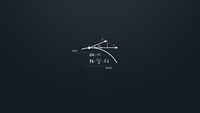
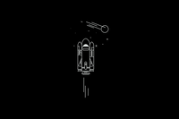

# Instructions

> [!NOTE]
> Require for `imagemagick`

1. download all the wallpapers to `todo` folder.
2. enter the `todo` folder, run:

```bash
../scripts/convert_images.sh .
../scripts/rename_by_sha256.sh .
../scripts/create_thumbnails.sh .
```

3. then, go to the upper folder, and run:

```bash
mv ./todo/*.preview.png ./thumbnails
mv ./todo/*.png ./pictures
```

4. add `.` to every file in `thumbnails`.
5. add the thumbnails to the `README.md` file.

# Preview








